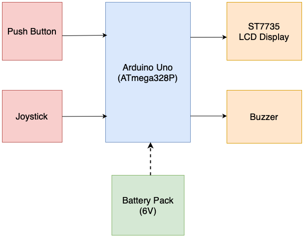
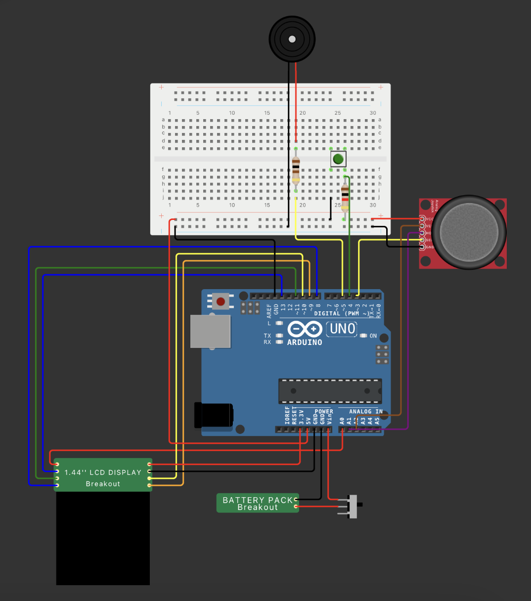

# Arduino Game Console

## Table of Contents
[1. Introduction](#introduction)\
[2. Overview](#overview)\
[3. Hardware Design](#hardware-design)\
[4. Software Design](#software-design)\
[5. Setup](#setup)\
[6. Conclusions](#conclusions)\
[7. Resources](#resources)

## Introduction

This project focuses on developing a Game Console designed to deliver an engaging gaming experience through a custom-built game inspired by Chicken Invaders. The console integrates an LCD display, a joystick for directional input, a push button, and a buzzer for sound feedback. The system offers a complete standalone experience by using a battery pack.

At the core of this project is the integration of an ATMega328P microcontroller with peripherals to handle game logic, render visuals, and process user inputs in real-time. This project includes principles of embedded systems like interrupts, analog-to-digital conversion (ADC), and timers to efficiently manage input, display updates, and game logic.

### LCD Close-Up View

The image below showcases the **ST7735 LCD Display** in operation, rendering the boot screen via SPI communication. 

## Overview
### Features
- Interactive Gameplay
    - A dynamic, challenging game inspired by Chicken Invaders.
    - Real-time updates and responses based on user input.
    - Scoring system to track player performance.
- Main Menu
    - Start new game.
    - View high scores.
    - Reset or restart options.
- Custom Hardware Integration
    - Joystick: For smooth bidirectional input and a built-in switch for special actions.
    - Push Button: Handles in-game triggers.
    - LCD Display: Renders game visuals and information.
    - Buzzer: Provides audio feedback for interactions.
- Portable Design
    - Powered by a 6V battery pack with an on/off switch.

### Block Diagram

## Hardware Design

### Components

| **Component**                  | **Quantity** | **Description**                          | **Source**               | **Datasheet**                                                                                   |
|--------------------------------|:------------:|------------------------------------------|--------------------------|-----------------------------------------------------------------------------------------------|
| ATMega328P Microcontroller     |      1       | Core microcontroller for the console      | University Robotics Lab  | [ATMega328P Datasheet](https://ww1.microchip.com/downloads/aemDocuments/documents/MCU08/ProductDocuments/DataSheets/Atmega48A-PA-88A-PA-168A-PA-328-P-DS-DS40002061B.pdf) |
| 6V Battery Pack with Switch    |      1       | Provides portable power                   | University Robotics Lab  | N/A                                                                                           |
| ST7735 LCD Display             |      1       | Renders visuals and game information      | University Robotics Lab  | [ST7735 LCD Datasheet](http://www.lcdwiki.com/res/MSP1443/1.44inch_SPI_Module_MSP1443_User_Manual_EN.pdf) |
| Analog Joystick with Switch    |      1       | Directional input + button functionality  | University Robotics Lab  | [Joystick Datasheet](https://naylampmechatronics.com/img/cms/Datasheets/000036%20-%20datasheet%20KY-023-Joy-IT.pdf) |
| Push Button (with 1k Resistor) |      1       | Action button input                      | University Robotics Lab  | N/A                                                                                           |
| 1kΩ Resistor                   |      1       | Limits current for the push button        | University Robotics Lab  | N/A                                                                                           |
| Buzzer                         |      1       | Outputs sound feedback                    | University Robotics Lab  | [Buzzer Datasheet](https://www.farnell.com/datasheets/1738927.pdf)                             |
| 100Ω Resistor                  |      1       | Limits current for the buzzer             | University Robotics Lab  | N/A                                                                                           |
| Breadboard                     |      1       | Circuit prototyping platform              | University Robotics Lab  | N/A                                                                                           |
| Wires                          |      26      | Various connections and support           | University Robotics Lab  | N/A                                                                                           |

---

### Wiring Overview

The **ST7735 LCD** and **joystick** are the primary input/output peripherals. The components are wired as follows:

- **Joystick**:  
  - `VCC` → 5V  
  - `GND` → GND  
  - `VRx` → A1 (Analog X-Axis input)  
  - `VRy` → A2 (Analog Y-Axis input)  
  - `SW` → Pin 3 (Digital button input)  

- **ST7735 LCD**:  
  - `VCC` → 3.3V  
  - `GND` → GND    
  - `CS` → Pin 10  
  - `RESET` → Pin 9  
  - `A0` → Pin 8 
  - `SDA` → Pin 11
  - `SCK` → Pin 13  
  - `LED` → Analog Pin A0

- **Push Button**:  
  - One side → Pin 4 (Digital input)  
  - Other side → GND through **1kΩ resistor**.  

- **Buzzer**:  
  - Positive terminal → Pin 5 (PWM Output through 100Ω resistor).  
  - Negative terminal → GND.  

- **6V Battery Pack**:  
  - `VCC` → Vin  
  - `GND` → GND  

### Electrical scheme

## Software Design

### IDE and Libraries
- **IDE**: Visual Studio Code + PlatformIO  
- **Libraries**:  
  - `Adafruit GFX` (for ST7735 LCD graphics)  
  - `Adafruit ST7735` (to interface with LCD)
  - `SPI` (used for communication with the ST7735 LCD)

## Setup

1. **Hardware Assembly**:  
   - Follow the wiring diagram to connect all components:  
     - Connect the **LCD** to digital pins for SPI communication.  
     - Wire the **joystick** and **push button** to their respective pins.  
     - Attach the **buzzer** to Pin 5 with a 100Ω resistor.  
     - Power the system via the **6V battery pack** connected to `Vin` and `GND`.

2. **Software Installation**:  
   - Install **Visual Studio Code** and **PlatformIO**.  
   - Clone the repository and open it in PlatformIO.  
   - Install required libraries through the PlatformIO Library Manager.  

3. **Upload Code**:  
   - Compile and upload the code to the **ATMega328P**.  

4. **Run the Console**:  
   - Use the on/off switch to power the system.  
   - Control gameplay using the joystick and button inputs.  

## Conclusions
[WIP]

## Resources

### Hardware Resources
- [ATMega328P Datasheet](https://ww1.microchip.com/downloads/aemDocuments/documents/MCU08/ProductDocuments/DataSheets/ATmega48A-PA-88A-PA-168A-PA-328-P-DS-DS40002061B.pdf)  
- [ST7735 LCD Datasheet](http://www.lcdwiki.com/res/MSP1443/1.44inch_SPI_Module_MSP1443_User_Manual_EN.pdf)  
- [Joystick Datasheet](https://naylampmechatronics.com/img/cms/Datasheets/000036%20-%20datasheet%20KY-023-Joy-IT.pdf)  
- [Buzzer Datasheet](https://www.farnell.com/datasheets/1738927.pdf)

### Software Resources
- [PlatformIO](https://platformio.org)  
- [Adafruit GFX Library](https://github.com/adafruit/Adafruit-GFX-Library)  
- [Adafruit ST7735 Library](https://github.com/adafruit/Adafruit-ST7735-Library)
